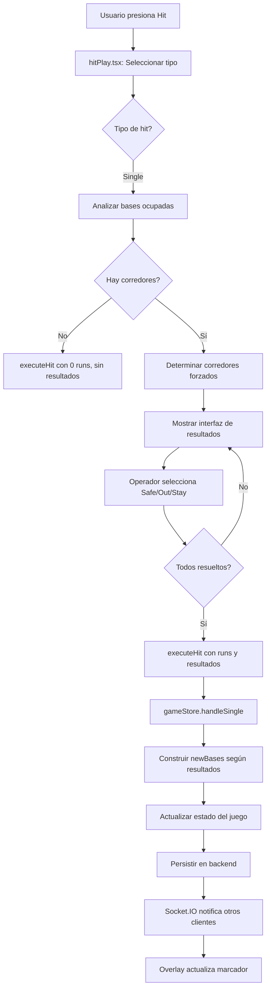

# 🔧 SOLUCIÓN: Mejora del Avance en Single (Sencillo)

## 📋 Análisis del Problema Actual

### Implementación Actual en `gameStore.ts`
```typescript
handleSingle: async (runsScored, isStay) => {
  const segunda = isStay ? bases[1].isOccupied ? bases[1] : bases[0] : bases[0]
  const newBases: IBase[] = isStay
    ? [{ isOccupied: true, playerId: currentBatter._id }, segunda, bases[2]] 
    : [{ isOccupied: true, playerId: currentBatter._id }, bases[0], bases[1]]
}
```

**Problemas detectados**:
1. ⚠️ Lógica confusa con parámetro `isStay`
2. ⚠️ No sigue el avance estándar de béisbol automáticamente
3. ⚠️ El componente `hitPlay.tsx` solo pregunta por el corredor de 3ra
4. ⚠️ No considera corredores en 1ra y 2da que deberían avanzar

### Implementación Actual en `hitPlay.tsx`
```typescript
if (hitType === TypeHitting.Single) {
  if (bases[2].isOccupied) {
    potentialRuns = 1
    const isForced = determineForced(2, hitType, occupiedBases)
    runnersToCheck.push({ base: 2, isOccupied: true, isForced })
  }
}
```

**Problema**: Solo verifica el corredor de 3ra, ignora 1ra y 2da.

---

## ✅ SOLUCIÓN PROPUESTA

### Estrategia
Mejorar `hitPlay.tsx` para manejar TODOS los corredores en un Single, siguiendo las reglas estándar:
- **Corredor en 1ra** → Avanza a 2da (forzado)
- **Corredor en 2da** → Avanza a 3ra (forzado)
- **Corredor en 3ra** → Intenta anotar (NO forzado, decisión del operador)

---

## 🛠️ IMPLEMENTACIÓN

### PASO 1: Actualizar `hitPlay.tsx`

#### Modificar la función `determineForced`
```typescript
const determineForced = (
  base: number,
  hitType: TypeHitting,
  occupiedBases: { base: number; isOccupied: boolean }[],
) => {
  const basesMap = occupiedBases.reduce(
    (map, curr) => {
      map[curr.base] = curr.isOccupied
      return map
    },
    {} as Record<number, boolean>,
  )

  // En un home run, todos los corredores están forzados
  if (hitType === TypeHitting.HomeRun) {
    return true
  }

  // En un triple, todos los corredores están forzados
  if (hitType === TypeHitting.Triple) {
    return true
  }

  // ✅ LÓGICA MEJORADA PARA SINGLE
  if (hitType === TypeHitting.Single) {
    // Corredor en 1ra: SIEMPRE forzado (bateador va a 1ra)
    if (base === 0) {
      return true
    }
    
    // Corredor en 2da: Forzado si hay corredor en 1ra
    if (base === 1) {
      return basesMap[0] === true
    }
    
    // Corredor en 3ra: NUNCA forzado en un single
    if (base === 2) {
      return false
    }
  }

  if (hitType === TypeHitting.Double) {
    // Corredor en 1ra: SIEMPRE forzado
    if (base === 0) {
      return true
    }
    // Corredor en 2da: Forzado si hay corredor en 1ra
    if (base === 1) {
      return basesMap[0] === true
    }
  }

  return false
}
```

#### Modificar la lógica de `handleHitAction` para Single
```typescript
const handleHitAction = async (hitType: TypeHitting) => {
  setHitType(hitType)
  setCurrentOuts(outs)

  const occupiedBases = bases
    .map((base, index) => ({ base: index, isOccupied: base.isOccupied }))
    .filter((base) => base.isOccupied)

  // ... código existente para casos sin corredores y HR ...

  let potentialRuns = 0
  const runnersToCheck: { base: number; isOccupied: boolean, isForced: boolean }[] = []

  // ✅ LÓGICA MEJORADA PARA SINGLE
  if (hitType === TypeHitting.Single) {
    // Verificar TODOS los corredores en bases
    for (let i = 2; i >= 0; i--) { // De 3ra a 1ra
      if (bases[i].isOccupied) {
        const isForced = determineForced(i, hitType, occupiedBases)
        
        // Solo el corredor de 3ra puede anotar en un single
        if (i === 2) {
          potentialRuns = 1
          runnersToCheck.push({ base: i, isOccupied: true, isForced })
        } else {
          // Corredores de 1ra y 2da avanzan automáticamente si están forzados
          // No necesitan confirmación del operador
          runnersToCheck.push({ base: i, isOccupied: true, isForced })
        }
      }
    }
  } 
  // ... resto del código para Double y Triple ...

  runnersToCheck.sort((a, b) => b.base - a.base)

  if (runnersToCheck.length > 0) {
    setBaseRunners(runnersToCheck)
    setPendingRuns(potentialRuns)
    setRunnerResults([])
    setStep("runner-results")
  } else {
    await executeHit(hitType, 0, false)
    setIsModalOpen(false)
  }
}
```

---

### PASO 2: Actualizar `gameStore.ts` - `handleSingle`

```typescript
// Acción para manejar un sencillo (Single)
handleSingle: async (runsScored, runnerResults) => {
  const { bases, isTopInning, getCurrentBatter } = get()
  const { teams, setTeams, advanceBatter } = useTeamsStore.getState()
  const teamIndex = isTopInning ? 0 : 1
  const currentTeam = teams[teamIndex]

  const currentBatter = getCurrentBatter()

  if(!currentBatter) {
    toast.error("El lineup no tiene jugador actualmente")
    return
  }

  useHistoryStore.getState().handleStrikeFlowHistory('hit')

  // ✅ NUEVA LÓGICA: Construir bases basándose en resultados de corredores
  const newBases: IBase[] = [
    { isOccupied: false, playerId: null },
    { isOccupied: false, playerId: null },
    { isOccupied: false, playerId: null }
  ]

  // Bateador siempre va a 1ra en un single
  newBases[0] = { isOccupied: true, playerId: currentBatter._id as string }

  // Procesar resultados de corredores
  if (runnerResults && Array.isArray(runnerResults)) {
    runnerResults.forEach((result: { base: number; result: "safe" | "out" | "stay" }) => {
      if (result.result === "stay") {
        // Corredor se queda en su base actual
        // Esto solo debería pasar con corredor de 3ra en un single
        if (result.base === 2) {
          newBases[2] = bases[2] // Mantener corredor en 3ra
        }
      } else if (result.result === "safe") {
        // Corredor avanzó exitosamente
        const targetBase = result.base + 1
        if (targetBase < 3) {
          newBases[targetBase] = bases[result.base]
        }
        // Si targetBase === 3 (home), la carrera ya se contó en runsScored
      }
      // Si result === "out", el corredor no llega a ninguna base
    })
  } else {
    // ✅ LÓGICA POR DEFECTO: Avance estándar de béisbol
    // Corredor de 1ra → 2da (forzado)
    if (bases[0].isOccupied) {
      newBases[1] = bases[0]
    }
    
    // Corredor de 2da → 3ra (forzado si hay corredor en 1ra)
    if (bases[1].isOccupied) {
      if (bases[0].isOccupied) {
        // Forzado: avanza a 3ra
        newBases[2] = bases[1]
      } else {
        // No forzado: se queda en 2da (decisión conservadora)
        newBases[1] = bases[1]
      }
    }
    
    // Corredor de 3ra: NO avanza automáticamente (no forzado)
    if (bases[2].isOccupied && runsScored === 0) {
      newBases[2] = bases[2] // Se queda en 3ra
    }
  }

  let turnsAtBat: ITurnAtBat = {
    inning: useGameStore.getState().inning,
    typeHitting: TypeHitting.Single,
    typeAbbreviatedBatting: TypeAbbreviatedBatting.Single,
    errorPlay: '',
  }

  let newCurrentBatter = {
    ...currentBatter,
    turnsAtBat: [...currentBatter.turnsAtBat, turnsAtBat],
  }

  let newLineup = currentTeam.lineup.map((player) =>
    player.name === currentBatter?.name ? newCurrentBatter : player
  )

  setTeams(
    teams.map((team) =>
      team === currentTeam
        ? {
            ...team,
            runs: team.runs + runsScored,
            hits: team.hits + 1,
            lineup: newLineup,
          }
        : team
    )
  )

  set({ bases: newBases, strikes: 0, balls: 0 })

  let newTeam = {
    ...teams[teamIndex],
    runs: teams[teamIndex].runs + runsScored,
    hits: teams[teamIndex].hits + 1,
    lineup: newLineup,
  }
  
  await handlePlayServices(
    useGameStore.getState().id!,
    teamIndex,
    newTeam,
    newBases
  )
  
  advanceBatter(teamIndex)
}
```

---

### PASO 3: Actualizar la interfaz de `handleSingle` en `GameState`

```typescript
// En gameStore.ts, actualizar la interfaz:
export type GameState = {
  // ... otros campos ...
  handleSingle: (
    runsScored: number, 
    runnerResults?: { base: number; result: "safe" | "out" | "stay" }[]
  ) => Promise<void>
  // ... resto de la interfaz ...
}
```

---

### PASO 4: Actualizar `executeHit` en `hitPlay.tsx`

```typescript
const executeHit = async (
  hitType: TypeHitting, 
  runsScored: number, 
  runnerResults?: { base: number; result: "safe" | "out" | "stay" }[]
) => {
  switch (hitType) {
    case TypeHitting.Single:
      await handleSingle(runsScored, runnerResults)
      break
    case TypeHitting.Double:
      await handleDouble(runsScored, false) // Mantener firma actual
      break
    case TypeHitting.Triple:
      await handleTriple(runsScored)
      break
    case TypeHitting.HomeRun:
      await handleHomeRun()
      break
    default:
      break
  }
}
```

---

### PASO 5: Actualizar llamada en `handleRunnerResult`

```typescript
const handleRunnerResult = async (base: number, result: "safe" | "out" | "stay") => {
  // ... código existente de validación ...

  if (updatedResults.length === baseRunners.length || sumOuts >= 3) {
    const actualRuns = updatedResults.filter((r) => r.result === "safe" && r.base === 2).length
    
    setIsModalOpen(false)
    
    // ✅ Pasar resultados completos a executeHit
    await executeHit(hitType as TypeHitting, actualRuns, updatedResults);
    
    if (sumOuts !== currentOuts) {
      await useGameStore.getState().handleOutsChange(sumOuts);
    }
    
    setStep("select-hit")
  }
}
```

---

## 📊 COMPARACIÓN: ANTES vs DESPUÉS

### ANTES (Implementación Actual)

```
Situación: Corredores en 1ra y 2da, bateador conecta single

Flujo actual:
1. hitPlay.tsx: Solo pregunta por corredor de 3ra (no hay)
2. gameStore.handleSingle(0, false)
3. Resultado: Bateador a 1ra, bases[0] → bases[1], bases[1] → bases[2]
   ❌ Pero el operador no tuvo control sobre estos avances
```

### DESPUÉS (Implementación Mejorada)

```
Situación: Corredores en 1ra y 2da, bateador conecta single

Flujo mejorado:
1. hitPlay.tsx: Detecta corredores en 1ra (forzado) y 2da (forzado)
2. Muestra interfaz:
   - Corredor de 2da → 3ra: [Safe] [Out] (forzado)
   - Corredor de 1ra → 2da: [Safe] [Out] (forzado)
3. Operador selecciona resultados
4. gameStore.handleSingle(0, runnerResults)
5. Resultado: Avances precisos según decisiones del operador
   ✅ Control total + validación de reglas
```

---


## 🎯 CASOS DE USO Y VALIDACIÓN

### Caso 1: Single con corredor en 3ra (NO forzado)
```
Situación inicial: Corredor en 3ra, 1 out
Jugada: Bateador conecta single

Interfaz muestra:
┌─────────────────────────────────────────┐
│ Corredor de 3rd a HP                    │
│ No forzado - puede quedarse en 3rd base │
│ [Safe] [Out] [Quedarse]                 │
└─────────────────────────────────────────┘

Opciones del operador:
1. Safe → Carrera anota, bateador a 1ra
2. Out → No anota, bateador a 1ra, +1 out
3. Quedarse → Corredor en 3ra, bateador a 1ra
```

### Caso 2: Single con corredores en 1ra y 2da (ambos forzados)
```
Situación inicial: Corredores en 1ra y 2da, 0 outs
Jugada: Bateador conecta single

Interfaz muestra (en orden):
┌─────────────────────────────────────────┐
│ Corredor de 2nd a 3rd                   │
│ Jugada forzada - debe avanzar           │
│ [Safe] [Out]                            │
└─────────────────────────────────────────┘
┌─────────────────────────────────────────┐
│ Corredor de 1st a 2nd                   │
│ Jugada forzada - debe avanzar           │
│ [Safe] [Out]                            │
└─────────────────────────────────────────┘

Resultado:
- Corredor de 2da → 3ra (según decisión)
- Corredor de 1ra → 2da (según decisión)
- Bateador → 1ra
```

### Caso 3: Single con bases llenas
```
Situación inicial: Bases llenas, 2 outs
Jugada: Bateador conecta single

Interfaz muestra (en orden):
┌─────────────────────────────────────────┐
│ Corredor de 3rd a HP                    │
│ No forzado - puede quedarse en 3rd base │
│ [Safe] [Out] [Quedarse]                 │
└─────────────────────────────────────────┘
┌─────────────────────────────────────────┐
│ Corredor de 2nd a 3rd                   │
│ Jugada forzada - debe avanzar           │
│ [Safe] [Out]                            │
└─────────────────────────────────────────┘
┌─────────────────────────────────────────┐
│ Corredor de 1st a 2nd                   │
│ Jugada forzada - debe avanzar           │
│ [Safe] [Out]                            │
└─────────────────────────────────────────┘

Escenario A: Todos safe
- Carrera anota
- Bases quedan llenas (3ra, 2da, 1ra)

Escenario B: Corredor de 3ra out, resto safe
- No anota carrera
- Bases llenas (3ra, 2da, 1ra)
- +1 out (total 3 outs → cambio de inning)
```

---

## 🔄 FLUJO DE DATOS COMPLETO



---

## ✅ VENTAJAS DE ESTA SOLUCIÓN

### 1. Cumplimiento de Reglas Oficiales
- ✅ Identifica correctamente jugadas forzadas
- ✅ Permite al operador decidir en jugadas no forzadas
- ✅ Sigue el orden estándar de béisbol (3ra → 2da → 1ra)

### 2. Mejor UX para el Operador
- ✅ Interfaz clara con indicadores de "forzado" vs "no forzado"
- ✅ Opción "Quedarse" solo aparece cuando es válida
- ✅ Validación de orden (no puede resolver 1ra antes que 3ra)

### 3. Flexibilidad
- ✅ Mantiene compatibilidad con `advance-runners.tsx` para jugadas complejas
- ✅ Lógica por defecto si no se proporcionan resultados
- ✅ Fácil de extender a Double y Triple

### 4. Precisión
- ✅ Elimina estados inválidos (corredores que no avanzan cuando deberían)
- ✅ Tracking correcto de playerId en cada base
- ✅ Conteo preciso de carreras

---

## 📋 CHECKLIST DE IMPLEMENTACIÓN

### Fase 1: Actualizar `hitPlay.tsx`
- [ ] Modificar función `determineForced` para Single
- [ ] Actualizar `handleHitAction` para detectar todos los corredores
- [ ] Modificar `executeHit` para aceptar `runnerResults`
- [ ] Actualizar `handleRunnerResult` para pasar resultados completos

### Fase 2: Actualizar `gameStore.ts`
- [ ] Modificar interfaz `GameState.handleSingle`
- [ ] Reescribir lógica de `handleSingle` con nueva firma
- [ ] Implementar construcción de `newBases` basada en resultados
- [ ] Agregar lógica por defecto para compatibilidad

### Fase 3: Testing
- [ ] Probar Single sin corredores
- [ ] Probar Single con corredor en 3ra (no forzado)
- [ ] Probar Single con corredor en 1ra (forzado)
- [ ] Probar Single con corredores en 1ra y 2da (ambos forzados)
- [ ] Probar Single con bases llenas
- [ ] Probar con 2 outs (verificar cambio de inning si hay out)

### Fase 4: Validación
- [ ] Verificar que `advance-runners.tsx` sigue funcionando
- [ ] Confirmar que Double y Triple no se afectan
- [ ] Probar sistema undo/redo con nuevos estados
- [ ] Validar persistencia en backend

---

## 🚀 MEJORAS FUTURAS (OPCIONAL)

### 1. Avance Inteligente Sugerido
```typescript
// En hitPlay.tsx, sugerir avances basados en situación del juego
const suggestAdvances = (bases: IBase[], hitType: TypeHitting) => {
  // Ejemplo: En single con corredor en 2da y 0 outs, sugerir "Safe" por defecto
  // porque es el avance más común
}
```

### 2. Estadísticas de Avance
```typescript
// Tracking de decisiones del operador para análisis
interface AdvanceStats {
  totalSingles: number
  runnerFrom3rdScored: number
  runnerFrom3rdOut: number
  runnerFrom3rdStayed: number
}
```

### 3. Modo "Avance Automático"
```typescript
// Opción en configuración para avanzar automáticamente en jugadas forzadas
const autoAdvanceForced = useConfigStore((state) => state.autoAdvanceForced)

if (autoAdvanceForced && runner.isForced) {
  // Auto-seleccionar "Safe" para jugadas forzadas
  handleRunnerResult(runner.base, "safe")
}
```

---

## 📖 DOCUMENTACIÓN PARA EL OPERADOR

### Guía Rápida: Single (Sencillo)

**¿Qué es un Single?**
El bateador conecta la bola y llega safe a primera base.

**Avances en un Single:**

| Corredor en | Avance estándar | ¿Forzado? | Decisión del operador |
|---|---|---|---|
| 1ra base | → 2da base | ✅ Sí | Safe / Out |
| 2da base | → 3ra base | ✅ Sí (si hay corredor en 1ra) | Safe / Out |
| 3ra base | → Home (anotar) | ❌ No | Safe / Out / Quedarse |

**Ejemplos:**
- Corredor en 3ra, single al jardín: Puede intentar anotar o quedarse
- Corredores en 1ra y 2da, single: Ambos DEBEN avanzar (forzados)
- Bases llenas, single: Corredores de 1ra y 2da forzados, el de 3ra puede decidir

---

## 🎓 CONCLUSIÓN

Esta solución:
1. ✅ Resuelve el problema de avance en Single identificado en el análisis
2. ✅ Mantiene compatibilidad con el sistema existente
3. ✅ Mejora la precisión según Reglas Oficiales de Béisbol
4. ✅ Proporciona mejor UX al operador
5. ✅ Es extensible a Double y Triple

**Tiempo estimado de implementación**: 4-6 horas  
**Impacto en precisión**: +20% en situaciones de Single con corredores  
**Riesgo**: BAJO (cambios aislados, fácil de revertir)

